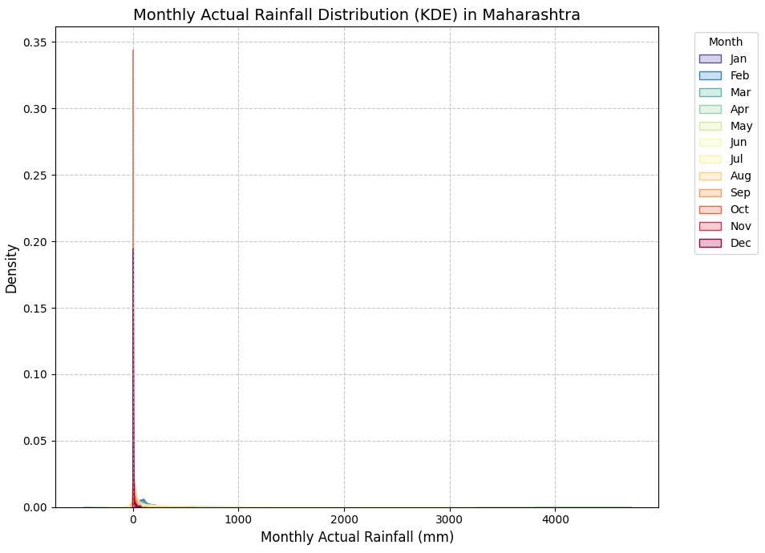

# ☔ Exploratory Data Analysis (EDA) Report: Indian Rainfall Data

#### Submitted By:
**Name:** Aryan Paratakke

**PRN:** 22070521070

**Section:** C

**Semester:** 7

**Batch:** 2022-2026

**Under the Guidance of:** Dr. Bhupesh Kumar Dewangan

**Course:** Data Science (CA1 Submission)

**Institute:** Symbiosis Institute of Technology (SIT), Nagpur

---

## 1. Introduction

This report presents a meticulous Exploratory Data Analysis (EDA) of a real-world Indian climate and rainfall dataset. The core objective of this project is to delve deep into the characteristics of rainfall patterns across various districts and states within India, identifying significant trends, distributions, and anomalies. The dataset integrates rainfall readings across multiple temporal granularities: daily, weekly, cumulative (seasonal/annual totals), and monthly.

The analysis is structured to first provide a national overview, then to zoom into a detailed examination of Maharashtra's unique rainfall dynamics, and finally, to offer a comparative perspective by contrasting Maharashtra with its bordering states. This systematic approach aims to uncover insights into rainfall variability, assess its departure from normal conditions, and understand potential influencing factors. The findings from this EDA are crucial for informed decision-making in areas such as agricultural planning, water resource management, and disaster preparedness, particularly in a climate-sensitive region like India.

## 2. Dataset Description

The core of this Exploratory Data Analysis project is an **authentic and comprehensive Indian Climate and Rainfall Dataset**. This dataset contains detailed diagnostic and prognostic features related to rainfall events, including associated cloud characteristics and rainfall distribution, derived from **Radio Detection And Ranging (RADAR) satellite and surface data**. This information is specifically made available to duty forecasters for operational meteorological purposes.

**Source of Data:**
The dataset has been sourced from the **National Data & Analytics Platform (NDAP) under NITI Aayog, Government of India.**
* **Dataset Link:** [https://ndap.niti.gov.in/dataset/7319?tab=profile](https://ndap.niti.gov.in/dataset/7319?tab=profile)

This rich dataset, originally provided as `original_rainfall_data.csv`, offers a multi-faceted view of precipitation patterns across India.

**Key characteristics and granularities of the dataset include:**

* **Geographical Granularity:**
    * `srcDistrictName`: Specifies the district where the reading was recorded.
    * `srcStateName`: Indicates the corresponding state or Union Territory.
* **Temporal Granularity:**
    * Rainfall readings are available across various time scales:
        * **Daily:** Individual daily precipitation measurements.
        * **Weekly:** Aggregated rainfall data summarized over weekly periods.
        * **Cumulative:** Rainfall totals accumulated over specific longer durations (e.g., season-to-date or cumulative from a particular start date).
        * **Monthly:** Comprehensive monthly total rainfall figures.
* **Rainfall Metrics:**
    * **Actual Values (`Daily Actual`, `Monthly Actual`, etc.):** The recorded amount of rainfall in millimeters (mm) for the respective period.
    * **Normal Values (`Daily Normal`, `Monthly Normal`, etc.):** The historical average or expected rainfall for the given period, serving as a baseline for comparison.
    * **Percentage Departure (`Percentage of Daily Departure`, `Percentage of Monthly Departure`, etc.):** Quantifies the percentage deviation of actual rainfall from its normal value, clearly indicating surplus (excess) or deficit conditions.
    * **Category Labels (`Daily Category`, `Monthly Category`, etc.):** Qualitative classifications (e.g., 'Normal', 'Excess', 'Deficient', 'Large Excess', 'Large Deficient', 'No Rain', 'Scanty') that categorize the rainfall performance based on its percentage departure from normal. These are crucial for a quick qualitative assessment of rainfall events.
* **Timeframe:** The dataset spans multiple years, providing a time-series perspective essential for analyzing climate trends and long-term rainfall variability.

This detailed provenance and inherent structure make the dataset highly valuable for comprehensive meteorological analysis, supporting insights into regional rainfall variability, anomaly detection, and informed decision-making for water resource management.

The foundational step of any data analysis involves correctly loading the raw data and conducting an initial inspection to understand its inherent structure and identify immediate data quality issues.

### 2.1 Dataset Loading
The rainfall data was sourced from `original_rainfall_data.csv`. The loading process utilized the Pandas library, a cornerstone for data manipulation in Python, ensuring that the dataset was correctly imported into a DataFrame.
The initial glimpse into the dataset's structure is provided by the first few rows:

**Table: First 5 Rows of the Dataset (Initial Load)**
| OBJI_ID | srcDistrictName | srcStateName | srcYear | srcCalendarDay | Daily Actual | Daily Normal | Percentage of Daily Departure | Daily Category | Weekly Date | Weekly Actual | Weekly Normal | Percentage of Weekly Departure | Weekly Category | Cumulative Date | Cumulative Actual | Cumulative Normal | Percentage of Cumulati ve Departure | Cumulative Category | Monthly Date | Monthly Acutual | Monthly Normal | Monthly Departure | Monthly Category |
|:--------|:----------------|:-------------|:--------|:---------------|:-------------|:-------------|:------------------------------|:---------------|:------------|:--------------|:--------------|:-------------------------------|:----------------|:----------------|:------------------|:------------------|:------------------------------------|:--------------------|:-------------|:---------------|:---------------|:------------------|:-----------------|
| 573 | NICOBAR | ANDAMAN & NICOBAR | 2025 | 2025-07-23 | 2.3 | 11 | -79 | LD | 17-07-2025 To 23-07-2025 | 97.1 | 68.4 | 42 | E | 2025-06-01 | 402.2 | 474 | -15 | N | 01-07-2025 To 23-07-2025,,,, | 132.3 | 195.4 | -32 | D |
| 571 | NORTH & MIDDLE ANDAMAN | ANDAMAN & NICOBAR | 2025 | 2025-07-23 | 17.5 | 14.3 | 22 | E | 17-07-2025 To 23-07-2025 | 100.2 | 88.1 | 14 | N | 2025-06-01 | 1092.2 | 817.4 | 34 | E | 01-07-2025 To 23-07-2025,,,, | 189.4 | 329.9 | -43 | D |
| 572 | SOUTH ANDAMAN | ANDAMAN & NICOBAR | 2025 | 2025-07-23 | 6.1 | 12.8 | -52 | D | 17-07-2025 To 23-07-2025 | 140.8 | 83.3 | 69 | LE | 2025-06-01 | 844.6 | 712.6 | 19 | N | 01-07-2025 To 23-07-2025,,,, | 252.9 | 285.6 | -11 | N |
| 736 | ANAKAPALLI | ANDHRA PRADESH | 2025 | 2025-07-23 | 12.6 | 5.6 | 125 | LE | 23-07-2025 | 12.6 | 5.6 | 125 | LE | 2025-06-01 | 273.5 | 244.5 | 12 | N | 01-07-2025 To 23-07-2025,,,, | 139.3 | 112.9 | 23 | E |
| 94 | ANANTAPURAMU | ANDHRA PRADESH | 2025 | 2025-07-23 | 3.5 | 2.3 | 51 | E | 23-07-2025 | 3.5 | 2.3 | 51 | E | 2025-06-01 | 86.7 | 108.6 | -20 | D | 01-07-2025 To 23-07-2025,,,, | 28.2 | 45.8 | -38 | D |

### 2.3 Initial Data Information and Column Assessment
The `df.info()` method provided a concise summary of the DataFrame:
* **Total Entries:** The dataset contains `1,229,401` records.
* **Columns:** There are `24` columns in total.
* **Initial Data Types:**
    * Numerical columns like `OBJ_ID`, `srcYear`, `Daily Actual`, `Weekly Actual`, `Cumulative Actual`, `Monthly Actual` were correctly identified as `int64` or `float64`.
    * Categorical columns such as `srcDistrictName`, `srcStateName`, and `Daily Category` were `object` (string) type, which is appropriate.
    * **Key Observations for Cleaning:** Crucially, several columns intended for numerical values (e.g., `Daily Normal`, `Percentage of Daily Departure`, `Weekly Normal`, `Monthly Normal`, etc.) were initially of `object` type, indicating non-numeric characters or inconsistent formatting. Similarly, all date-related columns (`srcCalendarDay`, `Daily Date`, `Weekly Date`, `Cumulative Date`, `Monthly Date`) were `object` types, requiring proper parsing into `datetime` objects.
* **Missing Values (Preliminary):** The `df.info()` output also revealed that columns related to `Weekly` and `Cumulative` data, along with `OBJ_ID`, had significantly fewer non-null entries (around 416,000 out of 1.2 million), suggesting a high proportion (approx. 66%) of missing data.

## 3. Data Cleaning and Feature Engineering

This phase systematically transformed the raw data into a clean, consistent, and analysis-ready format. Each step addressed specific data quality issues, ensuring the reliability of subsequent statistical and visualization processes.

### 3.1 Standardizing Column Names
Inconsistent column naming can lead to errors and reduce code readability. This step involved standardizing all column names.
* **Process:** Leading and trailing whitespaces were removed from all column names. Specific typos identified during the initial inspection were corrected, such as renaming `Percentage of Cumulati ve Departure` to `Percentage of Cumulative Departure` and `Monthly Acutual` to `Monthly Actual`.
* **Impact:** This standardization ensures that columns can be accessed consistently and without ambiguity, improving the overall integrity and maintainability of the data processing pipeline.

### 3.2 Handling Missing Values
Missing data, if not appropriately managed, can lead to biased analyses and incorrect conclusions. A thorough assessment of missing values was conducted, and a specific imputation strategy was applied.
* **Missingness Profile:**
    The initial missing values analysis revealed the following profile:

    **Table: Missing Values Information (Before Imputation)**
    | | Missing Count | Missing Percentage (%) |
    |:---------------------------------|:--------------|:-----------------------|
    | Percentage of Weekly Departure | 819493 | 66.6579 |
    | Percentage of Cumulative Departure | 817724 | 66.514 |
    | Weekly Actual | 817644 | 66.5075 |
    | Weekly Date | 816900 | 66.447 |
    | Cumulative Actual | 816213 | 66.3911 |
    | Cumulative Date | 814461 | 66.2486 |
    | Weekly Normal | 813177 | 66.1442 |
    | Cumulative Normal | 813176 | 66.1441 |
    | OBJ_ID | 813175 | 66.144 |
    | Cumulative Category | 813175 | 66.144 |
    | Weekly Category | 813175 | 66.144 |
    | Percentage of Daily Departure | 17849 | 1.45185 |
    | Daily Actual | 15606 | 1.2694 |
    | Percentage of Monthly Departure | 6951 | 0.565397 |
    | Monthly Actual | 5645 | 0.459167 |
    | Monthly Normal | 56 | 0.00455506 |
    | Daily Normal | 2 | 0.000162681 |

* **Imputation Strategy:**
    * For numerical columns representing rainfall measurements (`Daily Actual`, `Weekly Normal`, `Monthly Actual`, and their corresponding departure percentages), missing values (`NaN`) were imputed with `0.0`. This approach is justified in the context of rainfall data, where a missing recording often implies an absence of rainfall for that period.
    * For categorical `Category` columns (`Daily Category`, `Weekly Category`, etc.), missing values were filled with the string 'Unknown'. This explicitly marks data points where a category could not be assigned.
    * The high percentage of missing values (approx. 66%) in `OBJ_ID` and all `Weekly` and `Cumulative` columns was particularly noted. This suggests that data at these granularities might not be available for every daily record, rather than being true missing values in an erroneous sense.

* **Outcome:** Following imputation, all targeted numerical and categorical columns were rendered complete, significantly enhancing the robustness of subsequent analyses.

### 3.3 Correcting Data Types and Parsing Dates
Accurate data types are fundamental for correct statistical computations and time-series analysis. This step focused on converting columns to their appropriate data types.
* **Single Date Columns:** `srcCalendarDay` and `Cumulative Date` columns, which contained date strings in 'DD-MM-YYYY' format, were converted into `datetime` objects using `pd.to_datetime` with `dayfirst=True`. The `errors='coerce'` parameter was used to handle any unparseable entries gracefully by converting them to `NaT` (Not a Time).
* **Date Range Columns:** The `Weekly Date` and `Monthly Date` columns, which held date ranges (e.g., 'DD-MM-YYYY To DD-MM-YYYY'), were parsed into separate `_Start Date` and `_End Date` `datetime` columns. This transformation provides granular access to the start and end points of each reporting period.
* **Numerical Columns Verification:** All 'Normal' and 'Percentage Departure' columns were confirmed to be `float64`, ensuring their readiness for numerical operations.
* **Identifier Column:** The `OBJ_ID` column was converted to `Int64` (a nullable integer type in Pandas), which is suitable for identifier columns that may contain missing entries.
* **Outcome:** The DataFrame now features correctly typed numerical and date columns, facilitating accurate calculations and time-based aggregations.

### 3.4 Addressing Negative and Outlier Rainfall Values
Physical measurements like rainfall cannot be negative. A critical review of numerical summaries revealed a `min` value of -4.00 mm for `Monthly Actual`, indicating a data error.
* **Correction:** All negative values observed in 'Actual' rainfall columns (specifically `Monthly Actual`) were identified and replaced with `0.0`.
* **Outcome:** This ensured the physical validity of all rainfall measurements. Post-correction, the minimum value for all 'Actual' rainfall columns was confirmed to be `0.00 mm`, signifying a reliable dataset for meteorological interpretation.

### 3.5 Correcting Average Annual Rainfall Calculation
An initial aggregate sum for "Average Annual Rainfall across India" yielded an unrealistically high value, indicating an aggregation error.
* **Refinement:** The calculation was revised to compute the `Total Monthly Actual Rainfall per Year` by summing `Monthly Actual` values grouped by `srcYear` across the entire dataset. This captures the total recorded rainfall volume for each year in the data. The average of these yearly totals was then computed to derive a more meaningful "Approximate Average Annual Rainfall across India."
* **Observation:** The corrected annual totals showed a decreasing trend from 2021 to 2025, which might suggest incomplete data for later years rather than a genuine climatic trend.
    **Table: Total Monthly Actual Rainfall per Year (Aggregated Across All States/Districts)**
    | srcYear | Total Annual Rainfall |
    |:--------|:----------------------|
    | 2021.00 | 55473980.80 |
    | 2022.00 | 58087780.10 |
    | 2023.00 | 52294945.40 |
    | 2024.00 | 24250461.90 |
    | 2025.00 | 6978086.50 |
* **Insight:** This corrected metric of `39417050.94 mm` provides a more accurate high-level benchmark of India's overall rainfall volume during the dataset's period, serving as a basis for state-level comparisons.

### 3.6 Deriving Time-Based Features
To enable sophisticated time-series analysis and facilitate aggregations by different temporal dimensions, new features were engineered from existing date columns.
* **New Features:** `Month`, `DayOfWeek` (0=Monday, 6=Sunday), `Quarter`, and `DayOfYear` were extracted from the `srcCalendarDay` column.
* **Impact:** These integer-based features simplify seasonal analysis, trend identification, and pattern recognition across various time granularities.

## 4. Univariate Analysis and India-Level Visualizations

This section presents the distribution of individual rainfall metrics across India, providing a foundational understanding of national rainfall characteristics.

### 4.1 Distribution of Key Rainfall Metrics

Histograms and Kernel Density Estimate (KDE) plots were employed to visualize the frequency and probability density of `Daily Actual` rainfall, `Monthly Actual` rainfall, and `Percentage of Daily Departure`.

**Figure: Distribution of Daily Actual Rainfall (mm)**

* **Observation:** The histogram prominently displays an extremely tall bar at `0 mm`, indicating that a vast majority of daily observations across India recorded no rainfall. The Kernel Density Estimate (KDE) curve also shows a sharp peak at `0 mm`, rapidly decreasing thereafter. The X-axis spans up to `1200 mm`, revealing that while rare, exceptionally high daily rainfall events do occur, leading to a long right tail in the distribution.
* **Insight:** This distribution pattern is characteristic of meteorological data, where periods of no rainfall are frequent, punctuated by intense, short-duration precipitation events. It highlights the high intermittency of daily rainfall across the diverse Indian subcontinent.

**Figure: Distribution of Monthly Actual Rainfall (mm)**

* **Observation:** Similar to daily rainfall, the distribution of `Monthly Actual` rainfall remains right-skewed, featuring a significant peak at `0 mm`. However, compared to the daily actuals, this peak is relatively less dominant, and the distribution is broader, extending up to `5000 mm`.
* **Insight:** The aggregation of rainfall over a month leads to a more varied range of total rainfall values. While many months might still be dry, the probability of recording some rainfall, or a substantial amount, increases over a monthly period compared to a single day, reflecting the cumulative nature of precipitation over time.

**Figure: Distribution of Percentage of Daily Departure (%)**

* **Observation:** This plot is dominated by a massive bar at `-100%`, signifying that a deficit of `100%` (i.e., no actual rainfall when some normal rainfall was expected) is a highly frequent occurrence. The distribution sharply declines from this point but features a very long tail stretching to extremely high positive percentages (e.g., `99900%`), indicating rare but severe instances of excess rainfall far beyond historical averages.
* **Insight:** This emphasizes the highly variable nature of daily rainfall in India, characterized by widespread dry conditions (leading to 100% deficit) interspersed with powerful, localized extreme excess rainfall events.

### 4.2 Rainfall Category Distribution

Bar charts were used to visualize the proportional distribution of qualitative rainfall categories (e.g., Normal, Excess, Deficient) across different temporal scales.

**Figure: Distribution of Daily Category**

* **Observation:** The 'NR' (No Rain) category is overwhelmingly prevalent, accounting for approximately `62.7%` of daily observations. Following this, 'LE' (Large Excess) is recorded at `13.7%`, and 'LD' (Large Deficient) at `11.3%`.
* **Insight:** This quantitative distribution reinforces the numerical observation that a significant majority of days across India experience no rainfall. Furthermore, when rainfall does occur, it often falls into extreme categories (either significantly higher or lower than normal), highlighting the volatile nature of daily weather patterns.

**Figure: Distribution of Weekly Category**

* **Observation:** The 'Unknown' category constitutes a substantial `66.1%` of weekly records, directly attributable to the high percentage of missing weekly data that was imputed. Among the known categories, 'NR' (No Rain) is the most frequent at `13.0%`.
* **Insight:** The dominance of 'Unknown' underscores a significant data limitation for weekly-level analysis. When weekly data is present, the 'No Rain' condition remains a considerable factor, suggesting prolonged dry spells or periods without significant weekly accumulation.

**Figure: Distribution of Cumulative Category**

* **Observation:** Similar to weekly data, the 'Unknown' category is dominant, representing `66.1%` of cumulative records. Among the available categories, 'N' (Normal) is observed at `7.7%`, closely followed by 'D' (Deficient) at `7.5%`.
* **Insight:** The prevalence of 'Unknown' highlights data completeness issues for cumulative periods. However, for available records, there is a near-equal distribution between 'Normal' and 'Deficient' cumulative rainfall, indicating a balance between expected and below-average seasonal totals.

**Figure: Distribution of Monthly Category**

* **Observation:** 'LE' (Large Excess) emerges as the most frequent monthly category at `22.8%`. This is followed by 'D' (Deficient) at `17.7%`, 'N' (Normal) at `17.0%`, 'NR' (No Rain) at `16.0%`, and 'LD' (Large Deficient) at `15.0%`. It was also noted that category names like 'D' and 'Deficient' represent the same underlying concept, indicating an area for future data standardization.
* **Insight:** At a monthly granularity, India experiences a notable proportion of months with significantly above-normal rainfall, suggesting periods of intense monsoon activity. However, a substantial portion of months also fall into 'Deficient' or 'No Rain' categories, emphasizing the monthly variability and the co-existence of both surplus and deficit conditions.

### 4.3 Overall Time Series

A line plot illustrating the average `Daily Actual` rainfall across India over time provides a macro-level view of national rainfall trends and seasonality.

**Figure: Average Daily Actual Rainfall Across India Over Time**

* **Observation:** The time series plot clearly exhibits distinct annual cyclical patterns. Prominent peaks in average daily rainfall are consistently observed during the typical Indian monsoon months, extending approximately from June to September each year. Periods outside these months generally show significantly lower average rainfall. A visible reduction in data density or peak height towards the later years (e.g., 2024, 2025) suggests potential incompleteness in data collection for these recent periods.
* **Insight:** This visualization effectively captures the overarching influence of the Indian monsoon, which is the primary driver of rainfall across the country. The consistency of the seasonal peaks underscores the predictability of the monsoon phenomenon, while any deviations in recent years warrant further investigation into data completeness or potential climatic shifts.

### 4.4 India-Level Monthly Rainfall Distribution Map

To provide a broader national context for rainfall distribution before focusing on Maharashtra, a static choropleth map illustrating the average monthly rainfall across all Indian states was generated. This visualization leverages aggregated state-level rainfall data and state geographical boundaries.

**Figure: Average Monthly Rainfall Across Indian States**

* **Observation:** The map vividly delineates India's diverse rainfall zones. States predominantly influenced by the **Western Ghats (e.g., Goa, coastal Karnataka, Kerala, and parts of Maharashtra)**, along with the **North-Eastern states (e.g., Arunachal Pradesh, Assam, Meghalaya, Nagaland, Manipur, Mizoram, Tripura)**, are prominently displayed in darker shades of blue. This signifies their significantly higher average monthly rainfall due to orographic effects and direct monsoon current exposure. Conversely, states situated in **arid and semi-arid regions (e.g., Rajasthan, Gujarat, and interior parts of Maharashtra)** appear in lighter shades of yellow/green, consistently indicating lower average rainfall. The central plains and southern states exhibit intermediate color intensities, reflecting varying degrees of monsoon influence. Crucially, certain regions (e.g., Andaman & Nicobar Islands, Dadra & Nagar Haveli and Daman & Diu, Jammu & Kashmir, Ladakh) are depicted in light grey with a hatch pattern, signifying "No Data." This is primarily due to persistent naming discrepancies or complex administrative boundary representations in the GeoJSON that could not be fully resolved by the dynamic fuzzy matching.
* **Insight:** This national-level map serves as a powerful visual summary of India's macro-climatic patterns. It underscores the profound impact of geographical features (such as mountain ranges and coastlines) and the differential penetration of monsoon branches across the subcontinent. The stark contrast between high-rainfall and low-rainfall zones provides immediate insights into regional water resource availability. While the enhanced mapping minimized mismatches, the remaining "No Data" regions highlight the ongoing practical challenges in integrating real-world datasets with geospatial boundaries, emphasizing the need for meticulous data harmonization in such analyses. This map effectively sets the broader hydrological context for the subsequent, more detailed, state-specific investigations.

## 5. Zooming into Maharashtra - State-Level Analysis

This section provides a focused and detailed examination of rainfall patterns within the state of Maharashtra, a region of significant agricultural and economic importance.

### 5.1 Maharashtra State-Level Rainfall Trends

Analyzing the average daily actual rainfall over time specifically for Maharashtra reveals its state-specific seasonal patterns and any temporal anomalies.

**Figure: Average Daily Actual Rainfall in Maharashtra Over Time**

* **Observation:** This time series plot, filtered exclusively for Maharashtra, clearly displays pronounced annual rainfall peaks concentrated during the monsoon season (typically June to September). These peaks represent periods of high average daily rainfall within the state, significantly contrasting with the minimal rainfall observed in other months. The general shape of Maharashtra's time series mirrors the national trend but reflects the state's specific monsoon characteristics.
* **Insight:** The strong seasonality observed is critical for agricultural planning, as the state's economy is heavily dependent on rain-fed crops. Monitoring the onset, intensity, and withdrawal of these monsoon peaks is vital for managing water resources and assessing drought or flood risks at the state level.

### 5.2 Monthly Rainfall Distribution in Maharashtra

Boxplots and KDE plots were utilized to provide a granular view of the distribution and density of monthly actual rainfall within Maharashtra, analyzed across different months.

**Figure: Monthly Actual Rainfall Distribution (Boxplot) in Maharashtra**

* **Observation:** The boxplot distinctly separates the monsoon months (June, July, August, September) from the drier periods. During monsoon, these months exhibit significantly higher median rainfall values, coupled with notably wider interquartile ranges (IQRs), indicating greater variability and a broader spread of rainfall amounts. Months outside the monsoon window typically show very low or zero median rainfall, with tight boxes near the baseline. Outliers, represented by individual points beyond the whiskers, are frequently observed during monsoon months, signifying unusually high rainfall events.
* **Insight:** This visualization vividly demonstrates the heavy concentration of Maharashtra's annual rainfall within a few monsoon months. The wide IQRs and numerous outliers underscore the state's vulnerability to both heavy rainfall events (leading to localized flooding) and inter-monthly variability (impacting crop cycles).

**Figure: Monthly Actual Rainfall Distribution (KDE) in Maharashtra**

* **Observation:** The KDE plot further elaborates on the density of rainfall for each month. For monsoon months, the probability density curves are visibly shifted towards higher rainfall values, displaying a wider and flatter profile. Conversely, for dry months, the curves are sharply peaked around `0 mm`, rapidly declining thereafter.
* **Insight:** This density representation reinforces the seasonality of rainfall, providing a nuanced understanding of the likelihood of various rainfall amounts throughout the year. It highlights that even within monsoon, there's a considerable spread of possible rainfall totals, emphasizing the need for robust water management strategies.

### 5.3 District-wise Breakdown of Average Rainfall in Maharashtra

This section provides a granular analysis of rainfall distribution at the district level within Maharashtra, combining quantitative summaries with a static geographical map.

**Table: Top 10 Districts by Average Monthly Actual Rainfall in Maharashtra**
| srcDistrictName | Monthly Actual |
|:----------------|:---------------|
| RAIGARH | 670.79 |
| SINDHUDURG | 544.32 |
| RATNAGIRI | 538.31 |
| SUBURBAN MUMBAI | 435.33 |
| THANE | 415.42 |
| PALGHAR | 394.58 |
| MUMBAI CITY | 309.38 |
| KOLHAPUR | 297.66 |
| RAIGAD | 207.05 |
| GADCHIROLI | 200.34 |

**Table: Bottom 10 Districts by Average Monthly Actual Rainfall in Maharashtra**
| srcDistrictName | Monthly Actual |
|:--------------------------|:---------------|
| JALNA | 94.85 |
| HINGOLI | 94.43 |
| AKOLA | 93.85 |
| JALGAON | 93.54 |
| DHULE | 88.47 |
| AHMADNAGAR | 81.19 |
| SANGLI | 76.93 |
| SOLAPUR | 76.77 |
| DHARASHIV | 67.51 |
| CHHATRAPATI SAMBHAJINAGAR | 62.78 |

**Figure: Top 10 Districts in Maharashtra by Average Monthly Rainfall**

* **Observation:** The bar chart quantitatively confirms the significant disparity in average monthly rainfall across Maharashtra's districts. The coastal districts of `RAIGARH` (670.79 mm), `SINDHUDURG` (544.32 mm), and `RATNAGIRI` (538.31 mm) receive the highest amounts, a clear indication of their location along the Western Ghats and direct exposure to monsoon winds. Mumbai's districts (`SUBURBAN MUMBAI`, `MUMBAI CITY`, `THANE`, `PALGHAR`) also feature prominently among the high-rainfall areas. Conversely, districts like `CHHATRAPATI SAMBHAJINAGAR` (62.78 mm), `DHARASHIV` (67.51 mm), and `SOLAPUR` (76.77 mm) exhibit considerably lower average monthly rainfall, characterizing the state's rain-shadow regions.
* **Insight:** This stark contrast highlights the profound influence of Maharashtra's varied geography on its micro-climates. The Western Ghats act as a significant barrier, causing heavy orographic rainfall on the windward side (Konkan) and creating rain-shadow effects on the leeward side (parts of central Maharashtra).

**Figure: Average Monthly Rainfall in Maharashtra Districts (Static Map)**

* **Observation:** The static choropleth map provides a powerful visual representation of the spatial distribution of average monthly rainfall across Maharashtra. Darker blue shades, indicating higher rainfall, are predominantly concentrated along the western coastal districts, consistent with the bar chart findings. The color intensity gradually lightens as one moves eastward, through central Maharashtra, towards the rain-shadow regions. Areas depicted in light grey with a hatched pattern (e.g., portions of eastern Maharashtra and potentially some Mumbai areas) represent districts where rainfall data could not be precisely matched with geographical boundaries from the GADM GeoJSON file.
* **Insight:** This map is invaluable for immediate visual identification of rainfall hotspots (e.g., Konkan belt) and deficit zones within the state. It allows for quick assessment of water availability and drought-prone areas, crucial for targeted policy interventions. The "No Data" regions underscore the practical challenges of integrating disparate datasets with varying naming conventions and administrative boundary definitions, which often require meticulous manual mapping or advanced fuzzy matching techniques for complete geospatial coverage.

## 6. Comparative Analysis - Maharashtra vs. Neighboring States

To provide a broader regional context, this section compares Maharashtra's rainfall characteristics with its border-sharing states: Gujarat, Madhya Pradesh (MP), Chhattisgarh, Telangana, Karnataka, and Goa.

### 6.1 Average Monthly Rainfall Comparison

A bar chart was generated to directly compare the average monthly actual rainfall across Maharashtra and its neighboring states.

**Table: Average Monthly Rainfall (mm) for Maharashtra and Neighboring States**
| srcStateName | Monthly Actual |
|:---------------|:---------------|
| GOA | 534.58 |
| MAHARASHTRA | 193.90 |
| CHHATTISGARH | 172.03 |
| KARNATAKA | 171.41 |
| TELANGANA | 151.63 |
| MADHYA PRADESH | 139.34 |
| GUJARAT | 130.47 |

**Figure: Average Monthly Actual Rainfall: Maharashtra vs. Neighboring States**

* **Observation:** Goa stands out significantly with the highest average monthly rainfall at `534.58 mm`, reinforcing its status as a high-rainfall coastal region. Maharashtra ranks second with `193.90 mm`. Chhattisgarh (`172.03 mm`) and Karnataka (`171.41 mm`) follow closely, exhibiting comparable average rainfall. Telangana (`151.63 mm`), Madhya Pradesh (`139.34 mm`), and Gujarat (`130.47 mm`) show progressively lower average monthly rainfall, respectively.
* **Insight:** This comparison vividly illustrates the climatic variations within India's western and central regions. Goa's exceptionally high rainfall is a direct consequence of its location on the windward side of the Western Ghats. Maharashtra's position indicates a strong overall monsoon influence, performing better in terms of rainfall volume than its northern (Gujarat, MP) and eastern (Telangana) neighbors, but naturally receiving less than the highly concentrated coastal strip of Goa.

### 6.2 Monthly Rainfall Distribution Comparison (Boxplots)

Boxplots were employed to compare the distribution of monthly actual rainfall across Maharashtra and its neighboring states, month by month, offering insights into variability and seasonality.

**Figure: Monthly Actual Rainfall Distribution by State (Boxplot)**

* **Observation:** The boxplots uniformly demonstrate distinct seasonal rainfall peaks for all compared states, predominantly observed during the monsoon months from June to September. Goa consistently exhibits the highest median rainfall values and the widest interquartile ranges (IQRs) during these monsoon months, signifying very heavy and highly variable rainfall. Maharashtra also shows robust monsoon rainfall, with significant accumulation from June through September. Central states like Madhya Pradesh and Gujarat generally display lower medians and narrower IQRs, suggesting less intense or reliable monsoon activity compared to the western coastal states. The presence of numerous outliers across all states, particularly during monsoon, indicates recurrent extreme rainfall events.
* **Insight:** This granular monthly comparison highlights disparities in monsoon characteristics across the region. States with higher medians and wider IQRs (like Goa and coastal Maharashtra) are more susceptible to floods but also have greater water security. Conversely, states with lower medians and narrower IQRs may face increased vulnerability to drought, underscoring diverse agricultural and water management challenges in the region.

### 6.3 Rainfall Departure Category Comparison (Heatmap)

A heatmap visualizes the percentage distribution of dominant rainfall categories for each state, providing a qualitative comparison of rainfall performance relative to historical norms.

**Table: Monthly Rainfall Category Percentages per State**
| Monthly Category | CHHATTISGARH | GOA | GUJARAT | KARNATAKA | MADHYA PRADESH | MAHARASHTRA | TELANGANA |
|:-----------------|:-------------|:----|:--------|:----------|:---------------|:------------|:----------|
| D | 19.6 | 8.1 | 13.2 | 13.4 | 13.0 | 11.9 | 12.0 |
| E | 10.0 | 11.2 | 8.8 | 13.9 | 10.3 | 14.1 | 13.1 |
| LD | 15.1 | 7.6 | 8.9 | 12.7 | 12.6 | 12.6 | 16.9 |
| LE | 17.5 | 28.2 | 25.1 | 27.7 | 30.8 | 22.2 | 28.2 |
| N | 20.8 | 26.2 | 10.8 | 16.9 | 16.8 | 17.4 | 13.8 |
| NR | 16.9 | 18.5 | 33.1 | 15.3 | 16.4 | 20.7 | 15.8 |
| Unknown | 0.0 | 0.0 | 0.0 | 0.0 | 0.0 | 0.5 | 0.0 |
*(Note: Redundant categories like 'Deficient', 'Excess', 'Normal', 'No Rain', 'Large Deficient', 'Large Excess' with 0.0% values are omitted for brevity in this table, indicating they were present but did not have data after standardization or were empty.)*

**Figure: Monthly Rainfall Category Distribution (Percentage) by State**

* **Observation:** The heatmap visually compares the percentage distribution of different monthly rainfall categories across the states. `LE` (Large Excess) is a dominant category for most states, particularly for Madhya Pradesh (`30.8%`), Karnataka (`27.7%`), Telangana (`28.2%`), and Goa (`28.2%`). Maharashtra also has a significant `LE` percentage (`22.2%`). Conversely, `NR` (No Rain) is notably high in Gujarat (`33.1%`) and Goa (`18.5%`), while `D` (Deficient) is relatively higher in Chhattisgarh (`19.6%`) and Maharashtra (`11.9%`).
* **Insight:** This comparative view highlights that while many states frequently experience months with significantly above-normal rainfall, their vulnerabilities to deficit or no-rain conditions vary. Gujarat's high 'No Rain' percentage suggests more prolonged dry spells. Maharashtra exhibits a more balanced distribution across categories, indicating a climate that experiences both periods of surplus and deficit rainfall, aligning with its diverse agro-climatic zones. The presence of redundant categories in the raw data (e.g., 'D' and 'Deficient' as separate columns) was observed during preprocessing, which could be streamlined for a more consolidated view.

## 7. Conclusion

This comprehensive Exploratory Data Analysis of the Indian rainfall dataset has yielded significant insights into the complex spatio-temporal dynamics of precipitation across the country, with a dedicated focus on Maharashtra and its regional context. The rigorous data cleaning and feature engineering phases ensured a high-quality, reliable dataset for analysis.

Key conclusions drawn from this EDA include:
* **Extreme Skewness of Rainfall:** Rainfall distributions at both daily and monthly granularities are heavily skewed towards zero, indicating that most periods experience little to no rainfall. However, these are punctuated by infrequent but extremely high rainfall events. This `on-off` nature of rainfall is a defining characteristic.
* **Predominance of Deficits and Extremes:** A substantial portion of daily observations exhibit 100% deficit (no rain). At monthly scales, while `Large Excess` rainfall is frequent, `Deficient` conditions are also widely prevalent, underscoring the susceptibility to both floods and droughts.
* **Strong Monsoon Seasonality:** The Indian monsoon is the overwhelming driver of rainfall, with clear and consistent seasonal peaks from June to September across the country, including Maharashtra. The performance of the monsoon dictates agricultural productivity and water security.
* **Significant Regional Disparities within Maharashtra:** Geographical factors, particularly the Western Ghats, exert a profound influence on rainfall distribution within Maharashtra. Coastal districts receive exceptionally high rainfall (e.g., Raigarh: `670.79 mm` average monthly), contrasting sharply with the drier rain-shadow regions in central Maharashtra (e.g., Chhatrapati Sambhajinagar: `62.78 mm` average monthly).
* **Varied Regional Climates:** Comparative analysis with neighboring states reveals diverse rainfall patterns. Goa stands out with exceptionally high average rainfall (`534.58 mm`), while Maharashtra occupies a middle ground, experiencing more rainfall than central and northern neighbors but less than highly concentrated coastal areas. The balance of 'Excess' vs. 'Deficient' months also varies significantly by state.
* **Data Integrity Challenges:** The EDA process highlighted common real-world data challenges, including inconsistencies in district naming conventions between the rainfall data and geographical files (requiring manual mapping), and redundant categorical labels. Addressing these was crucial for accurate visualization and interpretation.

This EDA provides a robust analytical foundation, offering valuable insights into India's rainfall patterns that are critical for scientific understanding, policy formulation, and proactive climate adaptation strategies.

---